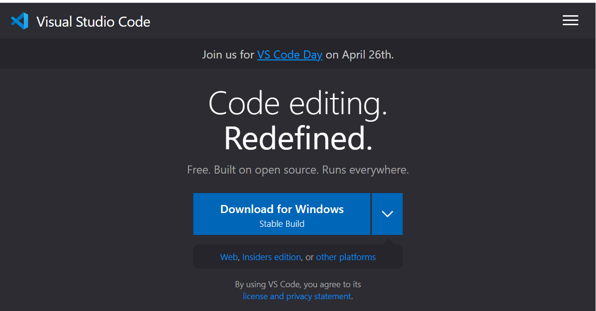
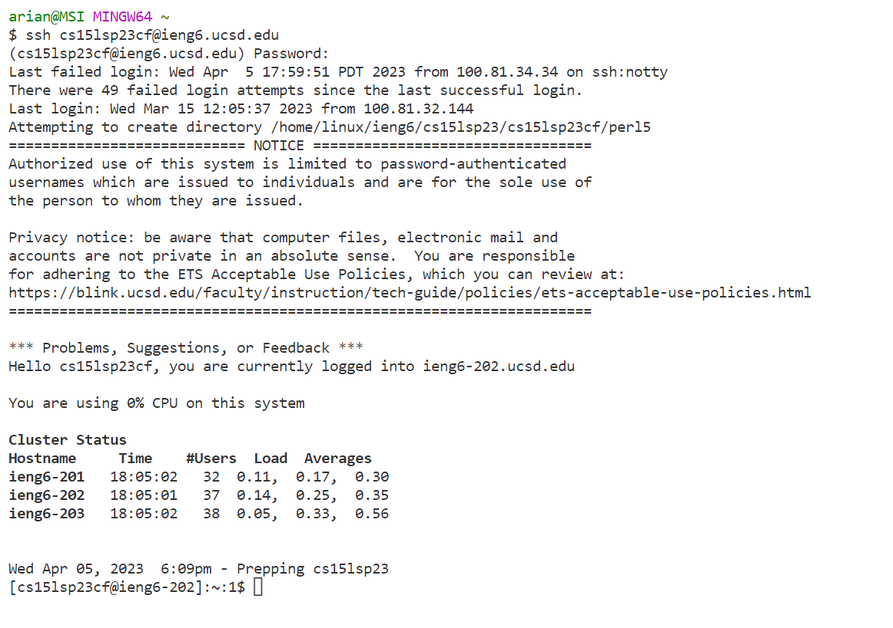
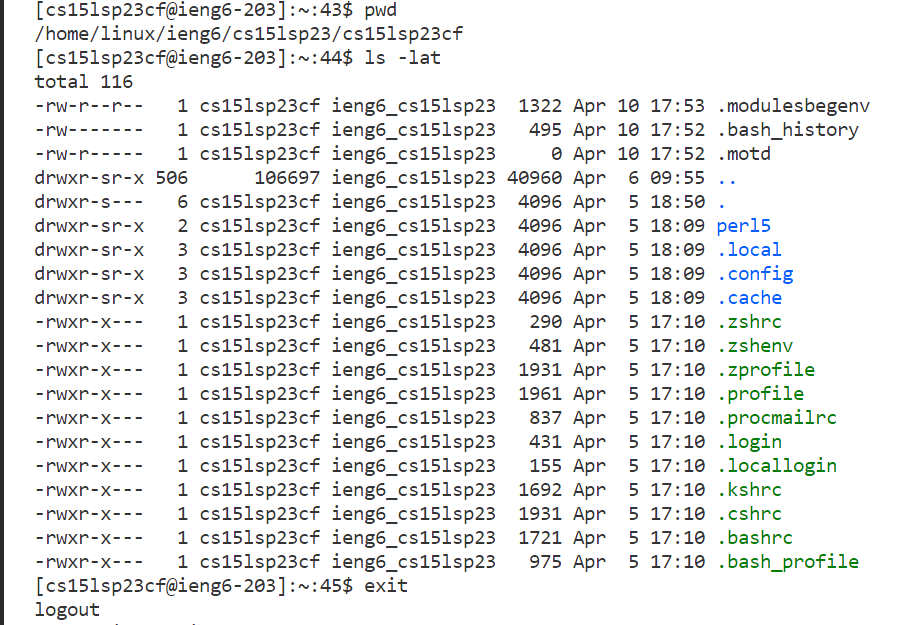

# Lap Report 1

## Steps in Logging Into a Course-Specific Account on UCSD's ieng6 server

1. Installing Visual Studio Code
 * Install VSCode using their [official website](https://code.visualstudio.com/) 
 * Open the installed package and follow the setup instructions
 * When it has finished installing, access VSCode by finding it in its set destination

2. Remotely Connecting
 * If you are using a Windows device, please install [Git for Windows](https://gitforwindows.org/) and set VSCode's default terminal to use [Git Bash]([https://gitforwindows.org/](https://stackoverflow.com/a/50527994))
 * Open VSCode's terminal and enter the Secure Shell Protocal command to remote to your course-specific account (replace the `zz` with your course specific account ID letters): `ssh cs15lsp23zz@ieng6.ucsd.edu`
 * Read the instructions that show after entering the command to connect to the server. When asked for your password, enter the course account's password.
 * Here is an example of a successful connection:
  
3. Trying Some Commands
 * Experiment with commands such as `cd`, `ls`, `pwd`, `mkdir`, and `cp`
 * `cd` command changes directories
 * `ls` command lists files on the current or specified directory
 * `pwd` command prints the working directory
 * `mkdir` command creates directories or subdirectories
 * `cp` command copies files or directories
| Commands | Description | | -------- | ------- | | `cd` | changes directories | | `ls` | lists files on the current or specified directory| | `pwd` | prints the working directory | | `mkdir` | creates directories or subdirectories | | `cp` | copies files or directories |
 * Exit out of the remove server using the command `exit` or the keys Ctrl-D
 
