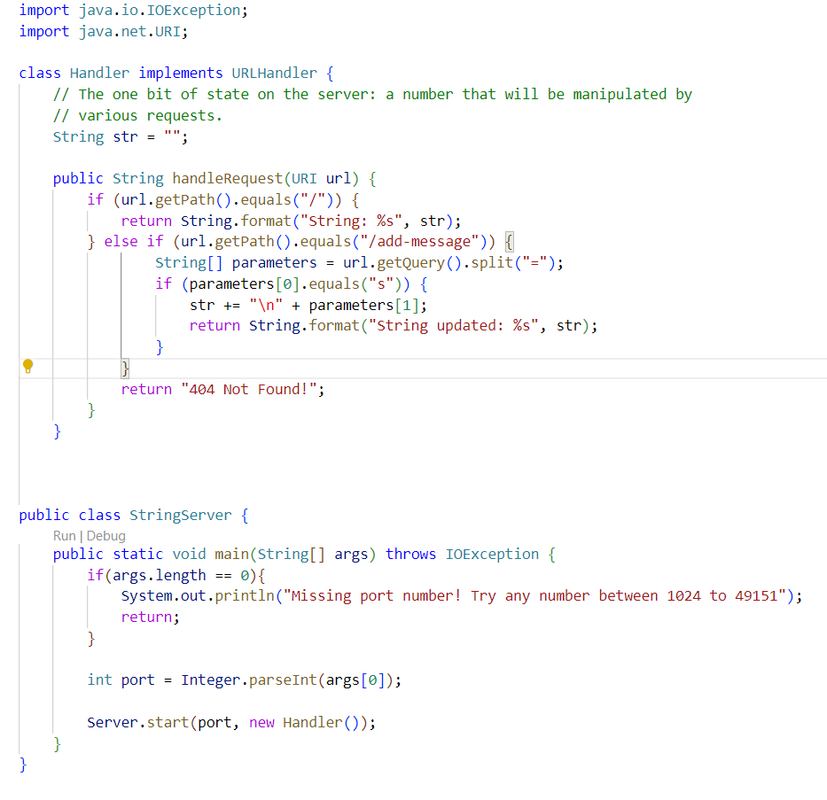
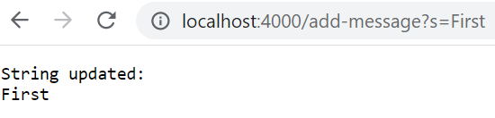
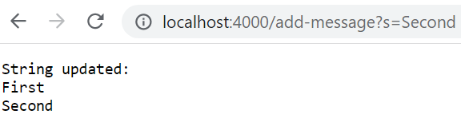
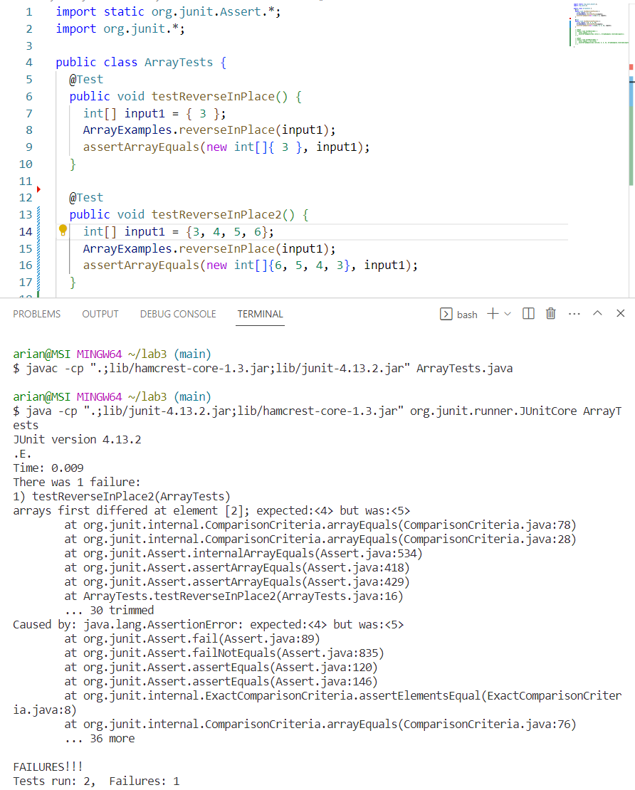

# Lap Report 2

# Servers and Bugs

## Part 1 - Creating a web server called StringServer

 * I used the NumberServer.java file from Lab 2 and made changes to it to so instead of incrementing numbers, it would add to a string

 * Above is the server in action by starting the server on local port 4000. I added the string "First" to it. The method that is called once I add the string are handleRequest(), which processes the url to determine what action to take. The field `str` had changed to contain "First".
 
 * The string was updated with "Second" in a new line. Method .getPath() was called to extract the path part of the URL and then used .getQuery() method to compare the expected query value. The field `str` updated again to add the string "Second" and a new line to it.

## Part 2 - Bugs from Lab 3
 * On lab 3, we worked with file ArrayExamples.java that had several bugs. Here is a part of the code that has a bug:
```
static void reverseInPlace(int[] arr) {
    for(int i = 0; i < arr.length; i += 1) {
      arr[i] = arr[arr.length - i - 1];
    }
  }
```
 * The method replaces the values prematurely before it reverses an array. So, we wrote failure-inducing JUnit tests that would reveal this incorrect behavior:
```
@Test
  public void testReverseInPlace2() {
    int[] input1 = {3, 4, 5, 6};
    ArrayExamples.reverseInPlace(input1);
    assertArrayEquals(new int[]{6, 5, 4, 3}, input1);
	}
```

 * A JUnit test that would pass with the uncorrected method would be:
```
@Test 
	public void testReverseInPlace() {
    int[] input1 = { 3 };
    ArrayExamples.reverseInPlace(input1);
    assertArrayEquals(new int[]{ 3 }, input1);
	}
```
* This test passes because there is only one value in the inputted array. Here are the two tests running with one failing as expected:

* To fix the code, we would need to create a new variable in the for loop and have it save the original array’s value so then you can do the reverse method with the loop, because initially the method replaced values with the already changed array. 

Before:
```
static void reverseInPlace(int[] arr) {
    for(int i = 0; i < arr.length; i += 1) {
      arr[i] = arr[arr.length - i - 1];
    }
  }
```
After:
```
static void reverseInPlace(int[] arr) {
    for(int i = 0; i < arr.length / 2; i += 1) {
      int x = arr[i]; 
      arr[i] = arr[arr.length - i - 1];
      arr[arr.length - i - 1] = x; 
    }
  }
```
* The code change addresses the issue of losing the original values in the array by having the loop only iterate half of the array to swap values.

## Part 3 - What I Learned from Lab 3
* I learned how to use the JUnit library to create and run tests in order to debug code. I also read what is the difference between symptom and bug. The symptom is the error the user sees when running code and the bug is the flaw in the program that may have symptoms. Then in the lab, using git commands such as `commit` and `push` when fixing the program reinforced my understanding of Github.

