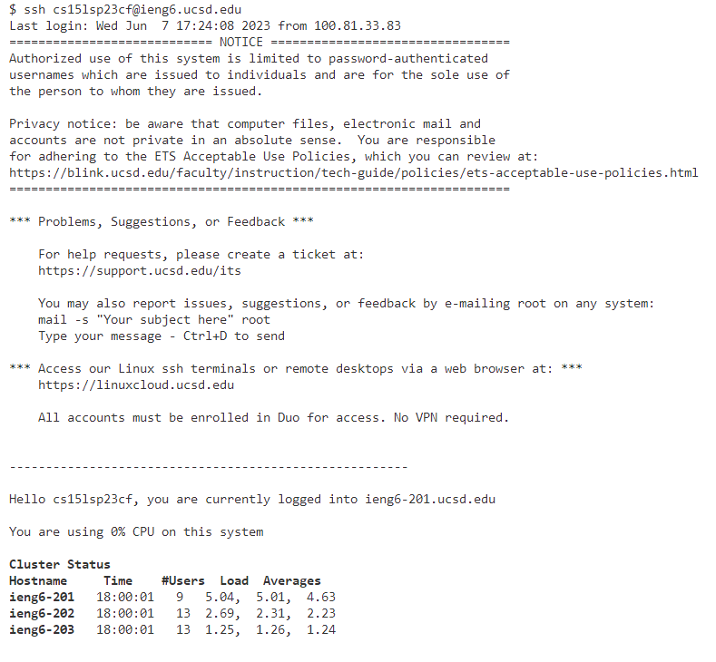
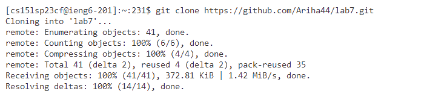
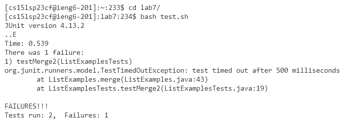
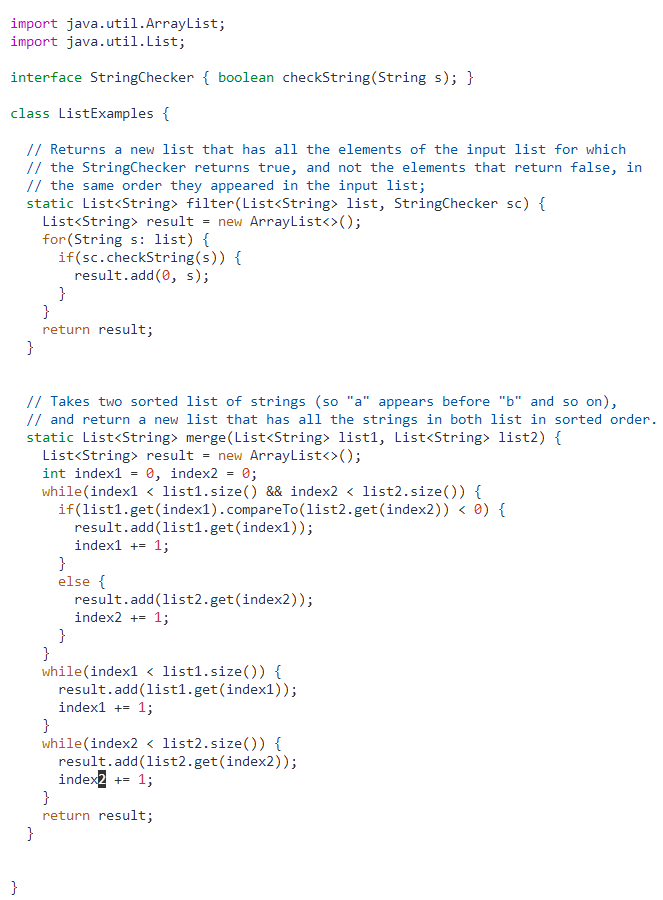
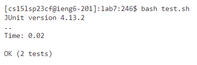
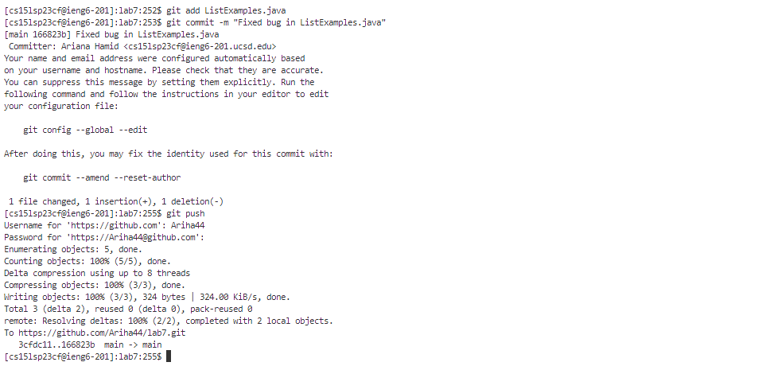

# Lap Report 4

## Step 4 - Log into ieng6

* Keys pressed: `ssh<space>cs15lsp23cf@ieng6.ucsd<enter>`
* I ran the ssh command to login to my course allows that allows me remote control one of UCSD's machines

## Step 5 - Clone your fork of the repository from your Github account

* Keys pressed: `git<space>clone<space><ctrl-v><enter>`
* I cloned the lab 7 repo by pasting the url I copied from my Github account.

## Step 6 - Run the tests, demonstrating that they fail

* Keys pressed: `cd<space>lab7/<enter>`, `bash<space>test.sh<enter>` 
* I had to set the current directory to the lab7 repository to run commands to directly access files in that repo. Then I used the bash command to run the test.sh file that contained the tests.

## Step 7 - Edit the code file to fix the failing test

* Keys pressed: `vim<space>ListExamples.java<enter>`, `<G><5k><e><x><i>2<esc><:>wq<enter>`
* To edit from the terminal, I used the already installed text editor vim to make changes to ListExamples.java by running the `vim` command. Afterwards, I used vim commands to navigate to the line that contains the error. `<G>` sent the cursor to the end of the final and then I used `5k` to go up 5 lines where the error was and then the rest of the commands allowed me to delete and replace the 1 in index1 to 2. After making the changes I ran `:wq` to save the changes and exit the file.

## Step 8 - Run the tests, demonstrating that they now succeed

* Keys pressed: `bash<space>test.sh<enter>`
* I entered the bash command to run the tests again and now it shows that they all passed.

## Step 9 - Commit and push the resulting change to your Github account (you can pick any commit message!)

* Keys pressed: `git<space>add<space>ListExamples.java<enter>`, `git<space>commit<space>-m<space>"Fixed bug in ListExamples.java<enter>`, `git<space>push<enter`
* To push the ListExamples.java change to my Github account I ran `git add`, which added the file to the queue. Then `git commit -m` to commit the file with a message. And finally `git push` to push the change to the remote repository.
