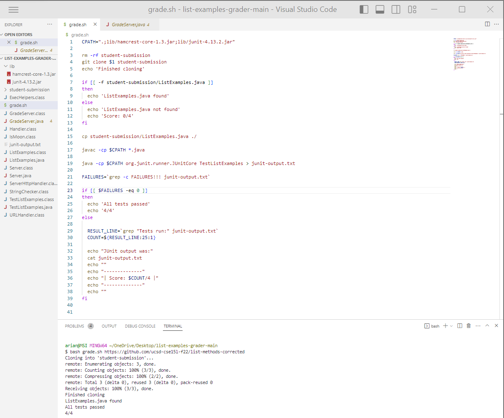

# Lap Report 5

# Part 1 – Debugging Scenario

## A symptom of a bug in a program:
* **What environment are you using (computer, operating system, web browser, terminal/editor, and so on)?**
* Windows 11 computer, VS Code

* **Detail the symptom you're seeing. Be specific; include both what you're seeing and what you expected to see instead. Screenshots are great, copy-pasted terminal output is also great. Avoid saying “it doesn't work”.**
* Bash Script:

* Contents of TestListExamples.java file that is used in the Bash Script to determine the score:

* Any time I run a bash script to grade a student submission, the score received is 1/4 no matter what. As shown on the screenshot, I used the repository with the corrected files, but the grader keeps giving a failing score.

* **Detail the failure-inducing input and context. That might mean any or all of the command you're running, a test case, command-line arguments, working directory, even the last few commands you ran. Do your best to provide as much context as you can.**
* I just entered `bash grade.sh https://github.com/ucsd-cse15l-f22/list-methods-corrected` in VS Code's terminal. I think there is something wrong with the way I am calculating the score in the bash script itself. 

## TA's response

 * Have you examined the section of the script where the failure count is determined? It seems that the script is always reporting 1 failure. Can you further investigate how you are setting the score?

## The Bug Resolved
* Bash Script:

* Contents of TestListExamples.java file that is used in the Bash Script to determine the score:

 * As we can see, the student  fixed the bug by parsing the actual test output and counted the number of failures from the junit-output.txt file using the `grep` command that extracts the actual number of failures for the scoring. `grep` searches and matches text files using specified string(s). It counted the number of failures in the JUnit output by searching for the string "FAILURES!!!". If there are no failures (i.e., the count is 0), it prints "All tests passed" and the score "4/4". If there are failures, it extracts the test run count from the JUnit output, prints the JUnit output, and then displays the score as "$COUNT/4", instead of having it display the score as $FAILURES/4, which would always result in 1/4 since FAILURES was set to 1. 

# Part 2 - Reflection
One lesson I learned from a lab (specifically lab 6) was how to use a bash script to create an automatic grader for a programming assignment. The goal was to write a script that takes the URL of a GitHub repository as input and provides a grade based on a student-submitted code. We were provided with a starter repository that we forked to begin our implementation. We used Bash to move the student's code to a designated directory. Compilation of the tests and the student's code is performed, with feedback on the errors based on the JUnit output. Overall, this lab provided valuable hands-on experience in using bash scripts to automate the grading process and showed the importance of usin bash scripts to automate processes such as effective evaluation for student submissions in a class.
