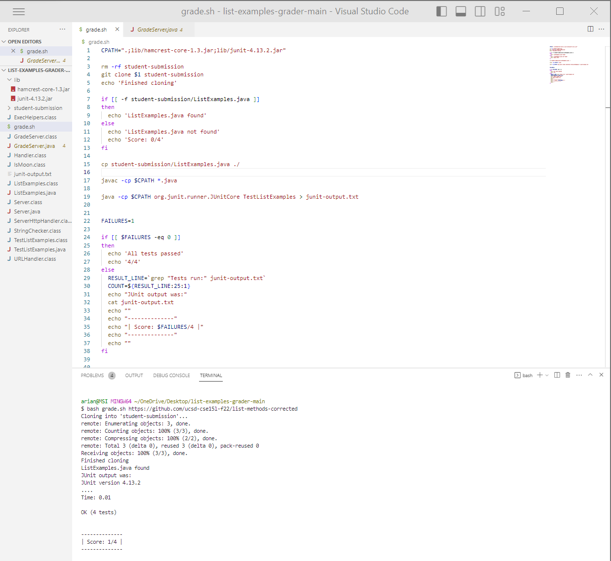

# Lap Report 5

# Part 1 – Debugging Scenario

## A symptom of a bug in a program:
* **What environment are you using (computer, operating system, web browser, terminal/editor, and so on)?**
* Windows 11 computer, VS Code

* **Detail the symptom you're seeing. Be specific; include both what you're seeing and what you expected to see instead. Screenshots are great, copy-pasted terminal output is also great. Avoid saying “it doesn't work”.**

* Any time I run a bash script to grade a student submission, the score received is 1/4 no matter what. As shown on the screenshot, I used the repository with the corrected files, but the grader keeps giving a failing score.

* **Detail the failure-inducing input and context. That might mean any or all of the command you're running, a test case, command-line arguments, working directory, even the last few commands you ran. Do your best to provide as much context as you can.**
* I just entered `bash grade.sh https://github.com/ucsd-cse15l-f22/list-methods-corrected` in VS Code's terminal. I think there is something wrong with the way I am calculating the score in the bash script itself. 

## TA's response

 * Have you examined the section of the script where the failure count is determined? It seems that the script is always reporting 1 failure. Can you further investigate how you are setting the score?

## The Bug Resolved

 * As we can see, the student  fixed the bug by parsing the actual test output and counted the number of failures from the junit-output.txt file using the `grep` command that extracts the actual number of failures for the scoring. `grep` searches and matches text files using specified string(s). 
  

